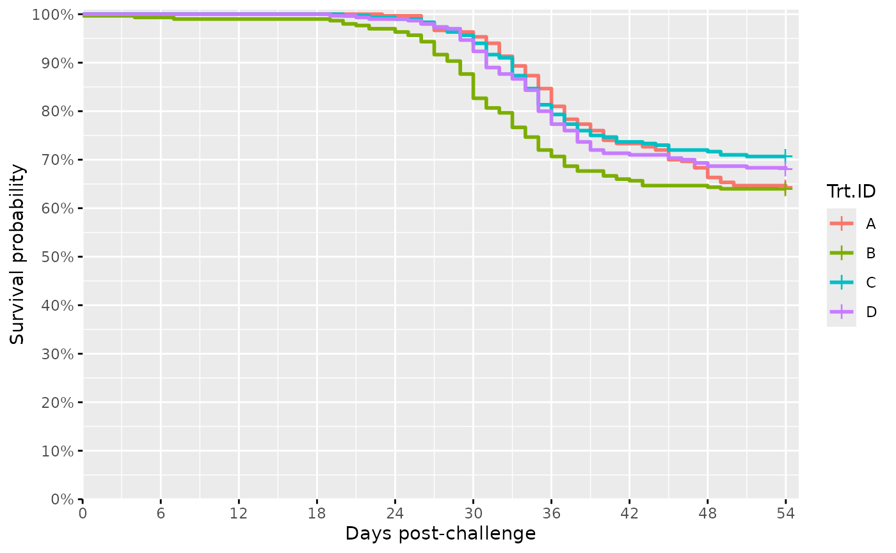
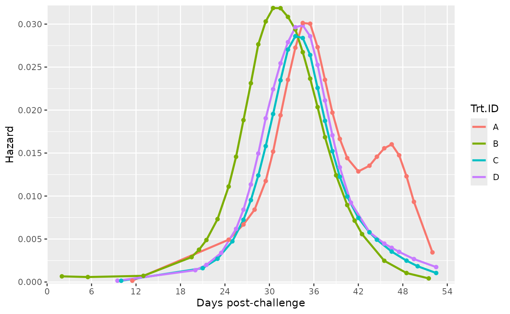

# Get Started!

Welcome to the documentation of the R package `safuncs`! This package is
designed to assist you in the analysis of your biological data
(e.g. survival).

Below I wrote a short tutorial on how some of the core functions in
`safuncs` can be used.

To get started, please install and load the package by running the
following code:

``` r

remotes::install_github("sean4andrew/safuncs") # install package
library(safuncs) # load
```

## Survival Analysis

At ONDA, survival data is often available to scientists initially in the
form of rows of entries for every mortality observed. This data needs to
be converted to a useful form for analysis in R or Prism. The function
[`Surv_Gen()`](https://sean4andrew.github.io/safuncs/reference/Surv_Gen.md)
shortens the data transformation step to just one line of code! Below, I
showcase its use.

Let us first examine the raw survival data we can get from our OneDrive
mort excel file:

``` r

data(mort_db_ex) # load example data file
head(mort_db_ex, n = 5) # view first 5 rows of data
#>   Tank.ID Trt.ID TTE Status
#> 1      C1      B   0      1
#> 2      C6      B   4      1
#> 3      C6      B   7      1
#> 4      C1      B  19      1
#> 5      C8      D  19      1
```

The 2nd-rightmost column named *TTE* indicates the Time to Event,
e.g. days post challenge, and the last column *Status* indicates the
type of event (1 = death, 0 = sampled-out or survived). Missing from
such a dataset are the rows representing surviving fish (Status = 0);
these needs to be present for a proper survival analysis.  
  
Introducing
[`Surv_Gen()`](https://sean4andrew.github.io/safuncs/reference/Surv_Gen.md)!

Obtain the proper survival data by simply inserting the mort database
into
[`Surv_Gen()`](https://sean4andrew.github.io/safuncs/reference/Surv_Gen.md).
Provide a time (TTE) indicating until when other fish survived and the
starting number of fish used per tank.

``` r

Surv_Gen(mort_db = mort_db_ex,
         starting_fish_count = 100, # per tank
         last_tte = 54)
```

Below is the output data’s bottom 5 rows which represent the generated
survivors (Status = 0).

    #>      Tank.ID Trt.ID TTE Status
    #> 1196      C8      D  54      0
    #> 1197      C8      D  54      0
    #> 1198      C8      D  54      0
    #> 1199      C8      D  54      0
    #> 1200      C8      D  54      0

You also get some printout messages for verification purposes:

    #> [1] "Your total number of tanks is: 12"
    #> [1] "Your total number of treatment groups is: 4"
    #> [1] "Your total number of fish in the output data is: 1200"

You can also specify tank-specific starting fish numbers using a
dataframe as input to `starting_fish_count`!

``` r

# reduce example data to simplify the demonstration
mort_db_ex2 = mort_db_ex[mort_db_ex$Tank.ID %in% c("C01", "C02", "C03"),]

# apply Surv_Gen()!
Surv_Gen(mort_db = mort_db_ex2,
         starting_fish_count = data.frame(Trt.ID = c("B", "A", "C"), # a vector of treatment groups for the specified tanks
                                          Tank.ID = c("C1", "C2", "C3"), # a vector with ALL tanks in the study
                                          starting_fish_count = c(100, 100, 50)), # a vector of fish numbers in same order as Tank.IDs
         last_tte = 54)
```

With a short R script as shown, you can quickly regenerate survival data
whenever there is a slight change in the mort database; perhaps from
day-to-day or after corrections.

For those wanting to use the generated survival data in prism, set the
argument `output_prism = TRUE` in
[`Surv_Gen()`](https://sean4andrew.github.io/safuncs/reference/Surv_Gen.md)
to save a prism-ready csv. in your working directory. If you want
starting and ending dates in the Prism output, input a starting date
into the argument `output_prism_date`, as shown:

``` r

Surv_Gen(mort_db = mort_db_ex,
         starting_fish_count = 100, # per tank
         last_tte = 54,
         output_prism = TRUE,
         output_prism_date = "08-Aug-2024")
```

Once the complete survival data has been obtained, plots can be easily
generated using
[`Surv_Plots()`](https://sean4andrew.github.io/safuncs/reference/Surv_Plots.md)!

``` r

data(surv_db_ex) # load example complete survival data

Surv_Plots(surv_db_ex, # plot the survival curve and hazard curve
           dailybin = FALSE) # recommended argument for good (large) sample size datasets
#> Warning: Using `size` aesthetic for lines was deprecated in ggplot2 3.4.0.
#> ℹ Please use `linewidth` instead.
#> ℹ The deprecated feature was likely used in the ggpubr package.
#>   Please report the issue at <https://github.com/kassambara/ggpubr/issues>.
#> This warning is displayed once per session.
#> Call `lifecycle::last_lifecycle_warnings()` to see where this warning was
#> generated.
#> $Survival_Plot
```



    #> 
    #> $Hazard_Plot

 The plots save
automatically to your working directory as a .tiff and in a power-point
editable format (.pptx). Notably,
[`Surv_Plots()`](https://sean4andrew.github.io/safuncs/reference/Surv_Plots.md)
accepts many more arguments that can influence the hazard plot in
particular and needs tailoring for your specific experiment. For more
details on these arguments, please see the functions’ [documentation
page](https://sean4andrew.github.io/safuncs/reference/Surv_Plots.html).

\############TO BE CONTINUED###########
